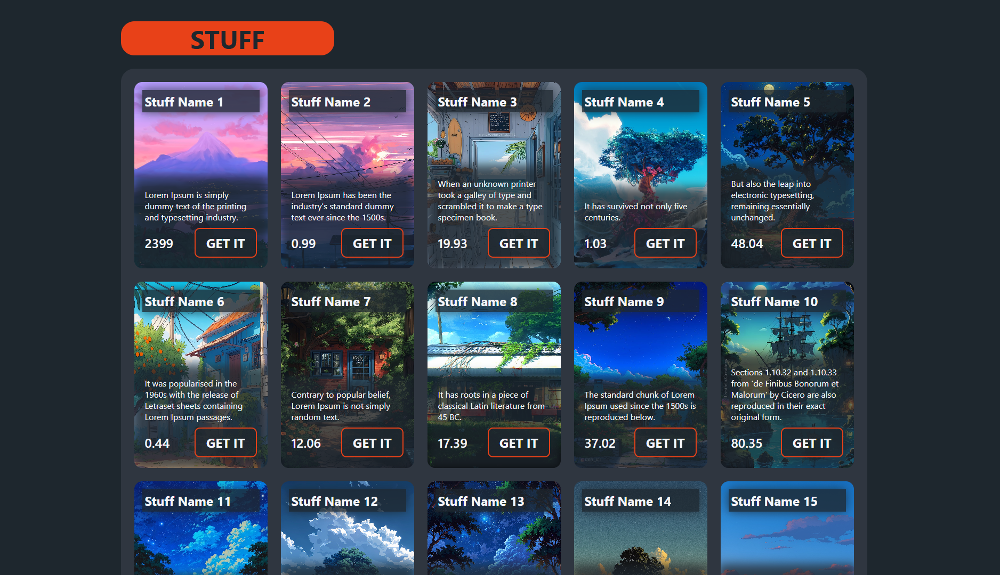

## Динамическая вёрстка
клонируйте этот проект ```git clone https://github.com/TonyHeiser/dynamic-layout.git .```

**Важно**: описание задания находится в script.js. Решение выполняйте прямо там.


## Задание: Динамическое создание карточек

На странице уже есть сетка для карточек:
```<ul class="main__cards"></ul>```

И массив данных для карточек: ```fetchedData```.

Задача:
1. Пройтись по массиву fetchedData.

2. Для каждого элемента создать <li> с классами: card, card{номер} (например, card1, card2 … card20)

3. Установить фоновое изображение карточки через JS (background-image).

4. Вставить внутрь <li> HTML:
  ```html
  <h2 class="card__title">{подумайте}</h2>
  <div class="down-under">
    <p class="card__description">{что тут}</p>
    <div class="card__price-btn">
      <span class="card__price">{надо}</span>
      <button class="card__btn">вставить</button>
    </div>
  </div>
  ```

5. Добавить <li> в контейнер .main__cards.

* Использовать только DOM-методы (createElement, appendChild, innerHTML и т.п.).
* Не трогать CSS и HTML — они уже готовы.
* Готовый результат должен быть как в result.png или похожим


